# INFORME DE ARQUITECTURA DE SOFTWARE (arc42) — LIVORA APP MÓVIL

**Proyecto:** Livora — Ecosistema Digital de Reciclaje Trazable con Incentivos Web3 en Stellar  
**Sistema:** `livora-app-movil` (Aplicación Móvil Híbrida Multiplataforma en Flutter / Dart 3)  
**Versión del Documento:** 3.0.0 (Migración Definitiva a Stellar/Soroban, Resiliencia Offline & Compliance Legal)  
**Fecha:** 2026-08-31  
**Estándar:** arc42 (Architecture Communication Canvas — Versión 8.2)  
**Estado:** Producción / Auditado  
**Autor:** Principal Mobile Architect & Lead Flutter/Dart Engineer  

---

## 1. Introducción y Objetivos (Introduction & Goals)

### 1.1 Resumen del Sistema y Objetivos de Negocio (Requirements Overview)
**Livora App Móvil** (`livora-app-movil`) es la interfaz cliente nativa para dispositivos móviles inteligentes (Android e iOS) diseñada para interconectar en tiempo real a todos los eslabones de la cadena de valor del reciclaje circular. La aplicación transforma la acción física de reciclar en transacciones verificables e inmutables soportadas por la red blockchain **Stellar (Soroban)** y recompensadas con **EcoTokens (ECO)**.

La aplicación móvil cubre de forma integral las operaciones de movilidad de cuatro actores fundamentales:

1. **Hogar / Ciudadano (`HOGAR`):**
   - Creación geolocalizada de solicitudes de recolección con estimación de materiales (PET, plástico, vidrio, cartón, metal, aluminio, orgánico) y captura fotográfica.
   - Generación de código PIN de 4 dígitos para validación presencial del traspaso de residuos.
   - Consulta en tiempo real de métricas de impacto ambiental (kg reciclados, solicitudes completadas) y saldo disponible de EcoTokens.
   - Canje de EcoTokens en tiendas físicas aliadas mediante escáner QR de alta velocidad y transferencias directas sin costo de red (*gasless*).

2. **Recolector de Campo (`RECOLECTOR`):**
   - Radar geoespacial de solicitudes pendientes (`PENDING`) filtradas por proximidad GPS (radio en km) y recepción instantánea de alertas mediante WebSockets (`Socket.IO`).
   - Gestión y consolidación de lote abierto (`OPEN` batch) en ruta.
   - Validación física de entregas mediante digitación del PIN otorgado por el hogar, con soporte de almacenamiento y validación optimista **Offline-First**.
   - Asignación y envío de lote a centros de acopio seleccionados manualmente o mediante escaneo del código QR del establecimiento.
   - Carga y seguimiento de documentos de identidad para verificación KYC (*Know Your Customer*).

3. **Centro de Acopio (`CENTRO_ACOPIO`):**
   - Recepción en planta de lotes en tránsito y registro de pesaje real certificado con báscula industrial por tipo de material.
   - Disparo asíncrono del proceso de liquidación e incentivación on-chain (80% al hogar, 20% al recolector).
   - Generación de código PIN y código QR dinámico de recepción para identificación rápida por parte de recolectores.
   - Consulta de stock clasificado y registro de ventas a industrias transformadoras.

4. **Tienda Aliada (`TIENDA`):**
   - Generación de códigos QR dinámicos de cobro especificando el monto exacto en EcoTokens.
   - Acreditación inmediata de transacciones de compra de bienes/servicios y visualización del comprobante digital en el explorador Stellar.
   - Solicitud de liquidación periódica de tokens acumulados hacia moneda de curso legal (Soles - PEN) y configuración de cuenta bancaria interbancaria (CCI).

---

### 1.2 Metas de Calidad (Quality Goals)

| Prioridad | Meta de Calidad | Motivación y Métrica de Éxito |
| :--- | :--- | :--- |
| **1** | **Resiliencia Offline-First** | Garantizar la continuidad operativa de los recolectores en zonas con nula o intermitente cobertura celular (3G/EDGE/sótanos). Las confirmaciones de recolección se almacenan en una base de datos local embebida (**Hive**) y se sincronizan automáticamente sin pérdida de datos al restablecerse la conexión. |
| **2** | **Rendimiento UI/UX & Fluidez (60 FPS)** | Renderizado estable a 60 cuadros por segundo (o 120 Hz en pantallas compatibles), minimizando *jank* mediante desacoplamiento reactivo con `Provider`, `IndexedStack` y compilación AOT de Dart 3. Tiempo de arranque en frío (*Cold Start*) < 1.8 segundos. |
| **3** | **Precisión de Geolocalización y Batería** | Captura precisa de coordenadas GPS mediante `geolocator` con políticas de timeout inteligente (5 s) y fallback a última posición conocida, optimizando el consumo energético del hardware. |
| **4** | **Abstracción Web3 sin Fricción (*Gasless UX*)** | Los usuarios operan sobre la blockchain de Stellar/Soroban sin necesidad de adquirir XLM, gestionar claves privadas mnemónicas ni firmar payloads crudos. Toda la complejidad criptográfica es gestionada de forma custodial por el backend mediante un Relayer subsidiado. |
| **5** | **Integración Ágil con Hardware Nativo** | Apertura inmediata del sensor de cámara mediante `mobile_scanner` con tasa de detección instantánea de códigos QR, control de linterna (*torch*) y selección de lente. |
| **6** | **Cumplimiento Legal y Normativo (Perú)** | Integración obligatoria de enlaces directos al Libro de Reclamaciones Virtual (Ley 29571 / Ley 32495), Términos de Uso, Política de Privacidad (Ley 29733) y flujo de borrado local/remoto de cuenta (Derechos ARCO). |

---

### 1.3 Partes Interesadas (Stakeholders)

| Rol / Actor | Expectativa Principal en la App Móvil |
| :--- | :--- |
| **Ciudadano / Hogar** | Interfaz limpia, intuitiva y rápida para solicitar recojo de reciclables y consultar/gastar sus EcoTokens. |
| **Recolector Urbano / Formalizado** | Herramienta de trabajo confiable, que no se congele en campo, que funcione sin cobertura y que permita calcular rutas y pesos estimados. |
| **Operador de Centro de Acopio** | Facilidad para ingresar pesajes de balanza y verificar la procedencia de los lotes recibidos. |
| **Comerciante Aliado** | Terminal punto de venta móvil sencillo para cobrar con QR y solicitar dinero fiat por sus ventas. |
| **Equipo de Auditoría & Seguridad** | Código tipado estricto con Dart 3 (sound null-safety), comunicación segura sobre HTTPS/WSS, cero secretos embebidos en el binario y conformidad con regulaciones peruanas. |

---

## 2. Restricciones de la Arquitectura (Architecture Constraints)

### 2.1 Restricciones Técnicas del Stack Móvil

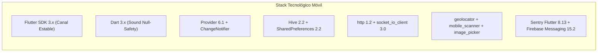

- **Lenguaje y SDK:** Dart 3 con *Sound Null-Safety* estricto y Flutter SDK multiplataforma.
- **Patrón de Estado:** Gestión de estado reactiva y desacoplada mediante `Provider` y `ChangeNotifier`.
- **Almacenamiento Local:** 
  - `shared_preferences` para flags de configuración, URLs de entorno, tokens JWT y perfil serializado.
  - `hive` y `hive_flutter` para persistencia no relacional binaria y cola offline (`offline_verifications`).
- **Comunicaciones:** Cliente HTTP tipado con interceptores de renovación de token y cliente WebSocket bidireccional (`socket_io_client`).

---

### 2.2 Restricciones de Compilación y Empaquetamiento

| Plataforma | Formato de Empaquetado | Versión Mínima de SO | Requerimientos de Compilación |
| :--- | :--- | :--- | :--- |
| **Android** | APK / Android App Bundle (`.aab`) | Android 5.0 (API Nivel 21 - Lollipop) | Java 17+, Gradle 8.x, Android Gradle Plugin (AGP) compatible, Target SDK 34+. |
| **iOS** | iOS App Store Package (`.ipa`) | iOS 13.0+ | macOS, Xcode 15+, CocoaPods 1.14+, Swift 5. |

---

### 2.3 Permisos Nativos y Políticas de Plataforma

#### Android (`AndroidManifest.xml`):
```xml
<uses-permission android:name="android.permission.INTERNET"/>
<uses-permission android:name="android.permission.ACCESS_FINE_LOCATION" />
<uses-permission android:name="android.permission.ACCESS_COARSE_LOCATION" />
<uses-permission android:name="android.permission.CAMERA" />
<uses-permission android:name="android.permission.POST_NOTIFICATIONS" />
```

#### iOS (`Info.plist`):
- `NSLocationWhenInUseUsageDescription`: Utilizada para geolocalizar puntos de recojo y filtrar solicitudes por radio.
- `NSLocationAlwaysAndWhenInUseUsageDescription`: Soporte de geolocalización en primer plano extendido.
- `NSCameraUsageDescription`: Requerido para capturar fotografías de residuos y escanear códigos QR de centros y comercios.
- `NSPhotoLibraryUsageDescription`: Acceso a galería para adjuntar comprobantes o fotos tomadas previamente.

---

### 2.4 Restricciones Legales y Normativas (Perú)
- **Protección de Datos Personales (Ley N.º 29733):**
  - Registro con checkboxes de consentimiento independientes y desmarcados por defecto.
  - Capacidad de ejercicio de derechos ARCO mediante la función nativa de eliminación de cuenta (`DELETE /users/me`), la cual purga simultáneamente los datos remotos y el almacenamiento local (Hive y SharedPreferences).
- **Libro de Reclamaciones Virtual (Ley N.º 29571 y Ley N.º 32495):**
  - Acceso directo y permanente en el menú de perfil hacia la hoja de reclamación virtual oficial.
- **Custodia Delegada Web3:**
  - Exclusión de llaves privadas en el dispositivo cliente.
  - Mensajes de confirmación explícita antes de ejecutar transferencias de EcoTokens: *"Al confirmar, autorizas a Livora a firmar la transacción en la blockchain Stellar. Esta acción es irreversible."*

---

## 3. Contexto y Alcance (System Scope & Context)

### 3.1 Delimitación del Sistema Móvil

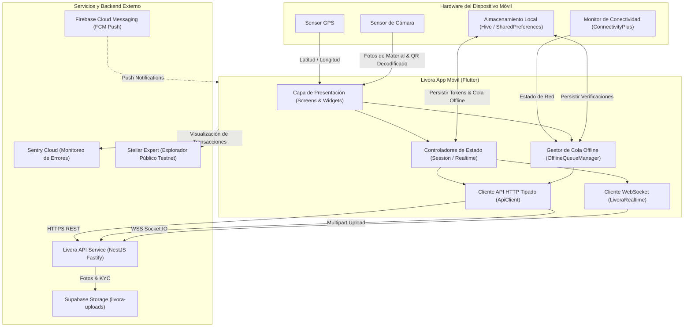

---

### 3.2 Interfaces Externas y Canales de Comunicación

| Canal / Interfaz | Protocolo | Destino / Proveedor | Propósito |
| :--- | :--- | :--- | :--- |
| **API REST** | HTTPS (TLS 1.3) | `https://stellar.52.200.2.107.sslip.io` | Autenticación, creación de solicitudes, lotes, pesajes, transferencias y perfil. |
| **WebSockets** | WSS (TLS) | `wss://stellar.52.200.2.107.sslip.io` | Notificación en tiempo real de nuevas solicitudes (`collection:created`) y lotes completados. |
| **Archivos Multipart** | HTTPS POST | `POST /uploads` | Subida de fotografías de reciclaje (`collection`) y documentos de identidad (`kyc`). |
| **Push Notifications** | APNs / FCM | Firebase Cloud Messaging | Avisos de estado de solicitudes y transacciones en segundo plano. |
| **Explorador Web3** | HTTPS Link Externo | `https://stellar.expert/explorer/testnet` | Consulta pública del comprobante digital y balance on-chain de cuentas `G...`. |
| **Telemetría** | HTTPS Sentry Protocol | Sentry Cloud | Captura automática de *crashes*, excepciones de plataforma y rendimiento. |

---

## 4. Estrategia de Arquitectura & Resiliencia (Solution Strategy)

### 4.1 Patrón Arquitectónico de Capas
La aplicación implementa una arquitectura desacoplada por responsabilidades estructurada bajo los principios de Clean Architecture simplificada para Flutter:

```
lib/
├── core/                  # Utilidades globales, temas, configuración de red y criptografía Stellar
│   ├── api_client.dart    # Cliente HTTP con interceptor 401, reintento 429 y parseo de errores
│   ├── app_theme.dart     # Design tokens, paleta de colores y componentes visuales Material 3
│   ├── env_config.dart    # Inyección de variables de entorno mediante --dart-define
│   ├── formats.dart       # Formateadores de fecha, peso (kg), roles y estados de negocio
│   ├── session.dart       # Controlador central de sesión, refresh token y ciclo de vida de usuario
│   └── stellar.dart       # Validadores de direcciones G..., hashes 64-hex y enlaces a Stellar Expert
├── models/                # Modelos de datos inmutables y deserializadores JSON
│   └── models.dart        # AuthUser, CollectionRequest, Batch, InventoryItem, KycApplication, etc.
├── screens/               # Vistas organizadas modularmente por dominio de rol
│   ├── acopio/            # Vistas para Centros de Acopio (pesaje industrial, lotes, ventas)
│   ├── auth/              # Vistas de autenticación (Login, Registro, Verificación OTP 6 dígitos)
│   ├── common/            # Vistas comunes (Billetera Web3, Notificaciones, Perfil, Escáner QR)
│   ├── hogar/             # Vistas para Hogares (Dashboard, Creación de solicitud con GPS, Detalle)
│   ├── recolector/        # Vistas para Recolectores (Radar de solicitudes, Mi lote en ruta, KYC)
│   ├── shell/             # Shell principal con IndexedStack y navegación por rol
│   └── tienda/            # Vistas para Tiendas/Almacenes (Cobro QR, Historial, Inventario)
├── services/              # Clientes de API, WebSockets, GPS y resiliencia offline
│   ├── livora_api.dart             # Métodos tipados para todos los endpoints del backend
│   ├── livora_realtime.dart        # Cliente Socket.IO reactivo y suscripción a salas de rol
│   ├── location_service.dart       # Integración con GPS nativo y gestión de permisos
│   └── offline_queue_manager.dart  # Gestor de cola offline con base de datos Hive
└── widgets/               # Componentes UI reutilizables y modulares
    ├── common.dart        # Diálogos de confirmación, badges, botones con loader, EmptyStates
    ├── live_indicator.dart# Indicador visual de estado de conexión WebSocket
    ├── livora_logo.dart   # Isotipo oficial vectorizado de Livora
    └── materials_editor.dart # Selector interactivo de materiales y pesos en kilogramos
```

---

### 4.2 Estrategia Offline-First y Resiliencia en Red

En las labores de recolección en campo, los operadores ingresan frecuentemente a sótanos, zonas industriales o puntos con sombra de señal celular. La arquitectura móvil implementa un patrón **Store & Forward** reactivo:

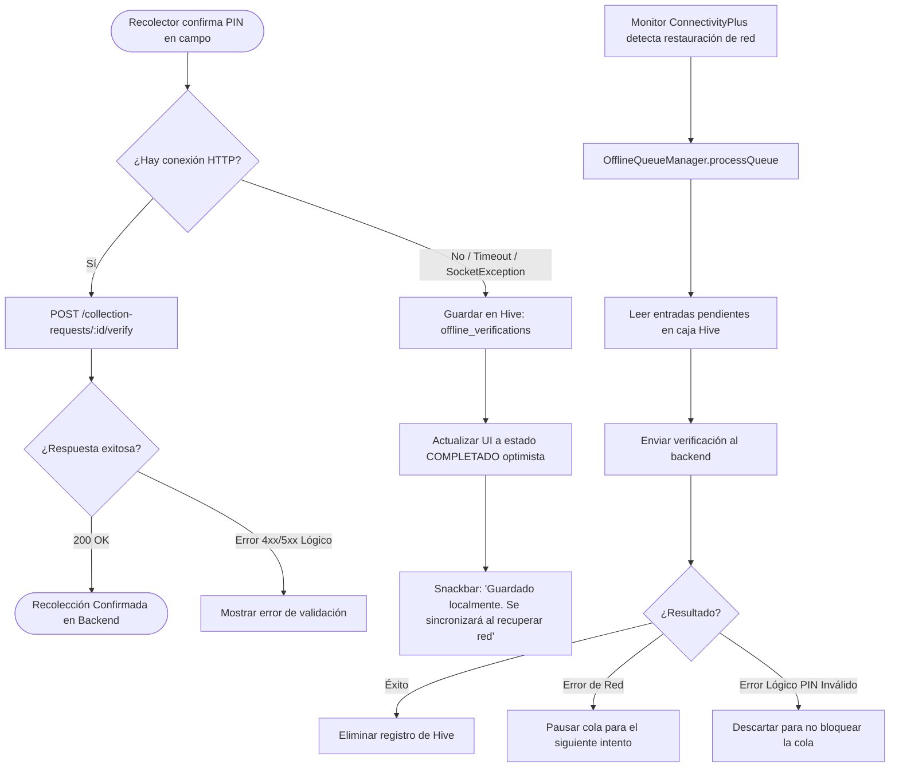

#### Reglas de Procesamiento de la Cola Offline:
1. **Diferenciación de Errores:**
   - **Errores de Red (`SocketException`, `TimeoutException`, `502/503`):** Se interrumpe la iteración de la cola para no sobrecargar el stack y se espera al siguiente evento de conectividad.
   - **Errores Lógicos (`400 Bad Request`, `PIN incorrecto`, `Solicitud ya procesada`):** Se eliminan de la caja local para evitar el bloqueo indefinido de la cola (*dead-letter pattern*).
2. **Purga al Cerrar Sesión:** Al invocar `SessionController.logout()`, la caja `offline_verifications` de Hive se limpia completamente para garantizar la privacidad entre distintos usuarios en el mismo dispositivo.

---

### 4.3 Gestión de Configuración y Entornos

La aplicación utiliza compilación parametrizada mediante `--dart-define` y `--dart-define-from-file=env.json`:

```dart
class EnvConfig {
  static const String apiBaseUrl = String.fromEnvironment(
    'API_BASE_URL',
    defaultValue: 'https://stellar.52.200.2.107.sslip.io',
  );

  static const String sentryDsn = String.fromEnvironment(
    'SENTRY_DSN',
    defaultValue: '',
  );
}
```

#### Migración Automática de URLs Legadas (`migrateLegacyBaseUrl`):
Para evitar fallos en dispositivos de prueba que mantenían guardada la URL del backend anterior en Arbitrum (`https://52.200.2.107.sslip.io` o `https://livora-api-service.onrender.com`), `ApiClient.migrateLegacyBaseUrl()` detecta dichas direcciones en la primera ejecución de la versión 3.0.0 y las redirige automáticamente al endpoint oficial de Stellar.

---

### 4.4 Gestión de Sesión, JWT y Renovación Automática

El backend emite tokens de acceso Supabase con expiración de 1 hora (`expiresIn: 3600`) y tokens de refresco rotativos (`refreshToken`). 

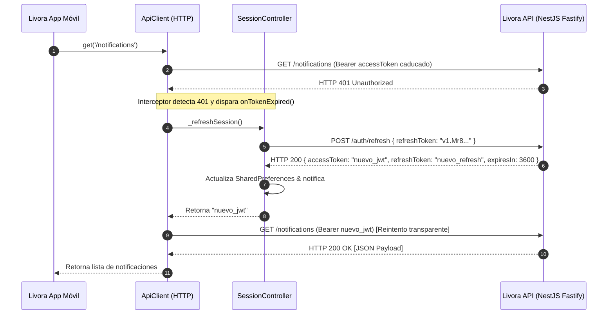

---

## 5. Vista de Bloques (Building Block View)

### 5.1 Diagrama de Bloques General (Nivel 1 & Nivel 2)

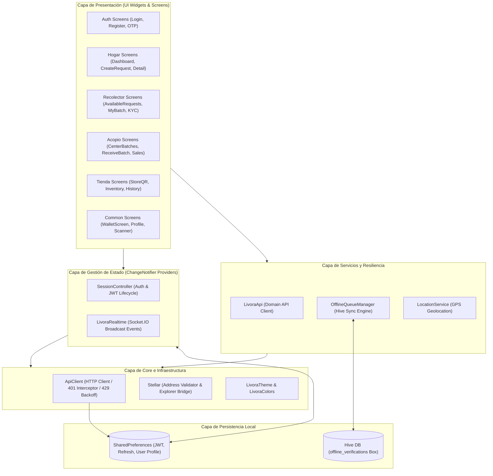

---

### 5.2 Módulos y Pantallas por Rol

#### 5.2.1 Módulo de Autenticación & Onboarding
- **`LoginScreen`:** Inicio de sesión con correo y contraseña. Acceso a selector de servidor para entornos de desarrollo/staging.
- **`RegisterScreen`:** Registro en dos pasos con selección de rol (`HOGAR`, `RECOLECTOR`, `CENTRO_ACOPIO`, `TIENDA`), validación estricta de contraseña en cliente (mínimo 8 caracteres, mayúscula, minúscula, número y símbolo) y enlaces legales a Términos y Privacidad.
- **`VerifyEmailScreen` / `VerifyOtpScreen`:** Ingreso de código OTP de 6 dígitos con cuenta regresiva de cooldown (60 s) para reenvío seguro.

#### 5.2.2 Módulo Hogar / Ciudadano
- **`HogarDashboard`:** Métricas de reciclaje (kg totales, solicitudes completadas, saldo ECO) e historial de solicitudes con badges de estado.
- **`CreateRequestScreen`:** Selector interactivo de materiales (`MaterialsEditor`), captura de fotografía con precarga multipart (`POST /uploads` con `purpose: collection`) y captura automática de coordenadas GPS. Al crearse, muestra un modal con el PIN de 4 dígitos.
- **`RequestDetailScreen`:** Visualización del estado del recojo, foto adjunta y PIN de entrega.

#### 5.2.3 Módulo Recolector de Campo
- **`AvailableRequestsScreen`:** Lista de solicitudes en estado `PENDING`. Incluye switch de radar GPS con radio configurable en kilómetros y suscripción reactiva a `collection:created` vía WebSocket. Acceso al estado de verificación de identidad (`KycScreen`) y reputación del recolector.
- **`MyBatchScreen`:** Gestión del lote actual (`OPEN`), resumen de materiales acumulados, botón de confirmación de PIN presencial del hogar (con soporte offline) y envío del lote al centro de acopio mediante UUID o escaneo QR.
- **`KycScreen`:** Carga y envío de documento de identidad (DNI/licencia en formato imagen o PDF) hacia `POST /uploads` (`purpose: kyc`) y solicitud formal de verificación.

#### 5.2.4 Módulo Centro de Acopio
- **`CenterBatchesScreen`:** Lista de lotes entrantes (`IN_TRANSIT`) y lotes procesados (`RECEIVED`). Visualización de PIN de recepción del centro y refresco dinámico.
- **`ReceiveBatchScreen`:** Formulario de pesaje industrial en báscula. Permite ajustar los pesos reales de cada material antes de enviar a `POST /batches/:id/receive` (HTTP 202) para liquidación on-chain.
- **`SaleScreen`:** Registro de venta de materiales consolidados a empresas transformadoras.

#### 5.2.5 Módulo Tienda Aliada / Almacén
- **`StoreQrGeneratorScreen`:** Generador de código QR para cobro de EcoTokens por compras físicas.
- **`StoreHistoryScreen`:** Historial de canjes completados y liquidaciones solicitadas a dinero fiat.
- **`InventoryScreen`:** Control de existencias clasificadas por material y registro de movimientos de entrada/salida.
- **`StoreProfileScreen`:** Configuración de RUC, Razón Social, Dirección fiscal y Cuenta Bancaria Interbancaria (CCI).

#### 5.2.6 Módulo Común / Transversal
- **`WalletScreen`:** Visualización de saldo de EcoTokens, copia de clave pública Stellar (`G...`), enlace directo a Stellar Expert Testnet, formulario de transferencia directa con Relayer gasless y botón para escanear y pagar QR de comercios.
- **`NotificationsScreen`:** Centro de notificaciones del usuario con marcado de lectura individual.
- **`QRScannerView`:** Pantalla optimizada con `mobile_scanner`, visor cuadrado centrado, control de linterna y alternancia de cámaras.
- **`ProfileScreen`:** Gestión de datos personales, captura de GPS del domicilio, cambio de contraseña, configuración de consentimientos de privacidad (Ley 29733), acceso al Libro de Reclamaciones y zona de eliminación de cuenta.

---

## 6. Vista Dinámica e Integración con Hardware (Dynamic View)

### 6.1 Proximidad GPS y Creación de Solicitud de Recolección

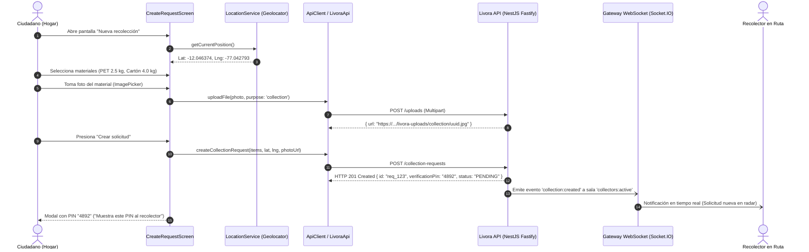

---

### 6.2 Validación de Entrega en Campo con PIN (Flujo Presencial)

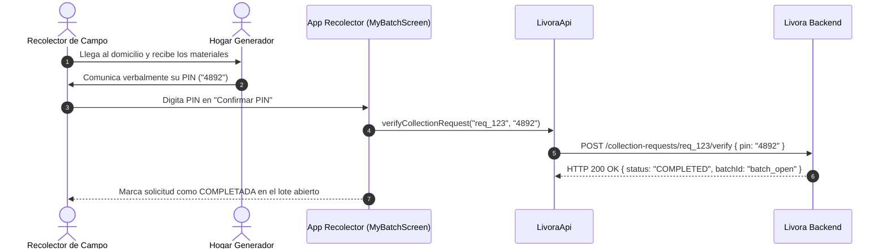

---

### 6.3 Resiliencia Offline-First ante Corte de Conectividad

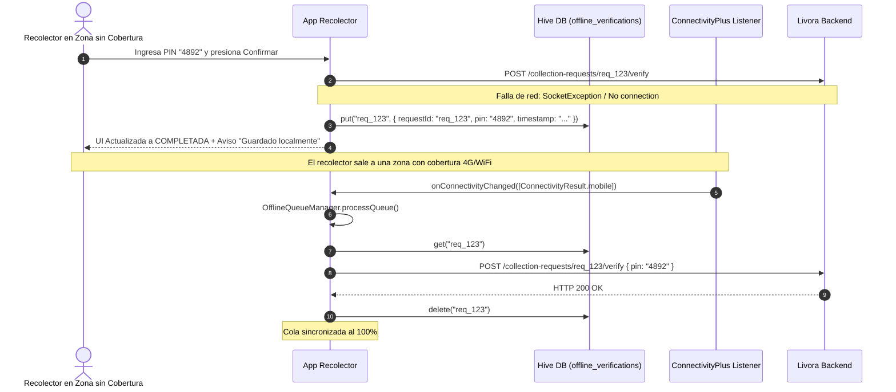

---

### 6.4 Escaneo QR y Canje de EcoTokens en Tienda Aliada

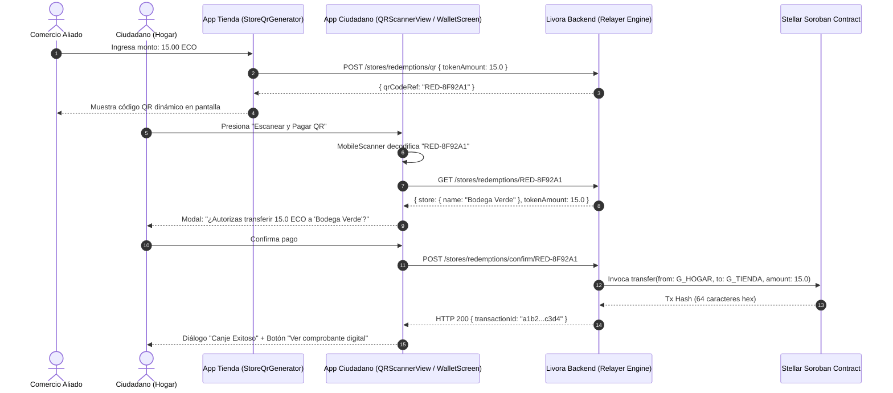

---

### 6.5 Recepción, Pesaje Industrial y Liquidación On-Chain

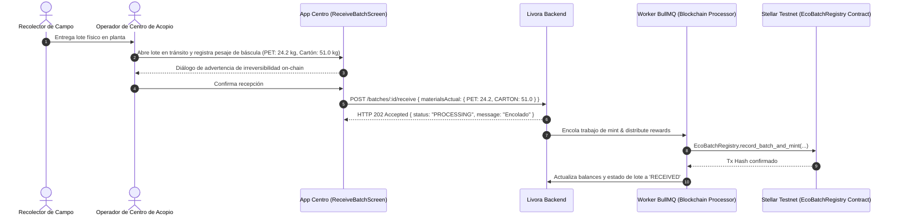

---

## 7. Vista de Despliegue y Seguridad Nativa (Deployment & Native Security)

### 7.1 Esquema de Compilación y Distribución

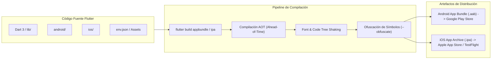

---

### 7.2 Gestión de Secretos y Control de Versiones

Para evitar la fuga de credenciales o claves criptográficas en repositorios de código:
1. **Reglas Estrictas en `.gitignore`:**
   - Exclusión de archivos de configuración de Firebase: `google-services.json` y `GoogleService-Info.plist`.
   - Exclusión de llaves de firma de release: `*.keystore`, `*.jks`, `key.properties`.
   - Exclusión de variables de entorno locales: `env.json`.
2. **Inyección en Tiempo de Compilación:**
   - Los secretos y URLs de backend se inyectan mediante `--dart-define-from-file=env.json` en los entornos de CI/CD.

---

### 7.3 Seguridad en el Dispositivo Móvil

- **Inexistencia de Claves Privadas en el Cliente:** La aplicación nunca genera, maneja ni almacena claves privadas de Stellar en el almacenamiento del teléfono. Las operaciones blockchain se delegan al Relayer del backend mediante tokens JWT autenticados.
- **Sandbox de Almacenamiento:** Los tokens JWT y las preferencias de sesión se guardan en el sandbox aislado de la aplicación a través de `shared_preferences` (EncryptedSharedPreferences en Android / Keychain en iOS según configuración de plataforma).
- **Protección contra Inyección y Man-in-the-Middle (MitM):** Todas las comunicaciones se realizan estrictamente sobre canales cifrados TLS 1.3 / HTTPS.

---

### 7.4 Cumplimiento ARCO y Purga de Datos Locales

En cumplimiento con la Ley N.º 29733 (Protección de Datos Personales de Perú):
- Cuando el usuario ejecuta la eliminación de su cuenta desde `ProfileScreen` (`DELETE /users/me`), el método `SessionController.logout()` ejecuta la purga total de la base de datos local Hive (`Hive.box('offline_verifications').clear()`) y elimina todas las entradas en `SharedPreferences`, garantizando que no queden datos residuales en el dispositivo.

---

## 8. Conceptos Transversales (Cross-cutting Concepts)

### 8.1 Manejo de Errores y Feedback al Usuario

1. **Estructura de Errores Tipada (`ApiException`):**
   - El cliente HTTP procesa tanto errores estándar como el formato con array `error.details` del backend:
   ```json
   {
     "error": {
       "code": "BAD_REQUEST",
       "message": "Error de validación",
       "details": ["La contraseña debe contener al menos un símbolo"]
     }
   }
   ```
   `apiErrorMessage()` prioriza la extracción de `details` para mostrar mensajes comprensibles y directos al usuario final.

2. **Control de Rate Limit con Backoff Exponencial (HTTP 429):**
   - Si el backend activa el Throttler (límite de 100 req / 60 s), `ApiClient` lee el encabezado `Retry-After` o aplica un retardo exponencial (2 s, 4 s) reintentando hasta 2 veces automáticamente antes de fallar.

3. **Feedback UI No Bloqueante (`showAppSnack`):**
   - Mensajes flotantes estandarizados con paleta de color semántica (verde para confirmaciones, rojo para errores, fondo oscuro).

---

### 8.2 Observabilidad, Telemetría y Crash Reporting (Sentry)

- La aplicación inicializa **Sentry Flutter** en `main.dart` capturando todas las excepciones no controladas en el árbol de widgets y en el `PlatformDispatcher`:
```dart
FlutterError.onError = (FlutterErrorDetails details) {
  FlutterError.presentError(details);
  Sentry.captureException(details.exception, stackTrace: details.stack);
};

PlatformDispatcher.instance.onError = (Object error, StackTrace stack) {
  Sentry.captureException(error, stackTrace: stack);
  return true;
};
```

---

### 8.3 Comunicación en Tiempo Real vía WebSockets

- **Conexión Idempotente:** `LivoraRealtime` conecta automáticamente al iniciar la sesión en `HomeShell` utilizando el token de sesión (`auth: { token: authToken }`).
- **Salas Automáticas por Rol:** El servidor asigna las salas en base al rol autenticado (`collectors:active`, `center:<id>`, `store:<id>`). La app no emite comandos `join` manuales, simplificando el flujo.
- **Streams Broadcast Desacoplados:** Las vistas se suscriben a eventos específicos (`collection:created`, `batch:completed`) mediante `StreamSubscription` sin interferir entre pantallas.

---

### 8.4 Abstracción y Utilidades Web3 en Stellar

La clase `Stellar` (`lib/core/stellar.dart`) centraliza la lógica de validación y presentación blockchain:
- **Validación de Clave Pública:** Expresión regular para direcciones ED25519 en formato Base32 (`^G[A-Z2-7]{55}$`).
- **Validación de Hash de Transacción:** Detección de hashes hexadecimales reales de 64 caracteres (`^[0-9a-f]{64}$`).
- **Discriminación de Modo Simulado:** Identificación y bloqueo de enlaces hacia transacciones sintéticas de prueba (`relayer...`).
- **Formateo Visual:** Acortamiento estético de direcciones largas (ej. `GA3LZ7…2QXGEB`).
- **Deep Linking al Explorador:** Generación de URIs seguras hacia `https://stellar.expert/explorer/testnet/`.

---

## 9. Diseño de Interfaz de Usuario y Experiencia (UI/UX Design Tokens)

### 9.1 Paleta de Colores Corporativa (`LivoraColors`)

| Token de Color | Valor Hex | Muestra | Uso en la Aplicación |
| :--- | :--- | :---: | :--- |
| `LivoraColors.deep` | `#003B2B` | 🟩 | Títulos principales, AppBars, textos de alto contraste y botones oscuros. |
| `LivoraColors.forest` | `#006852` | 🟩 | Color primario de marca, botones principales de acción (*FilledButton*), avatares. |
| `LivoraColors.green` | `#00A878` | 🟢 | Badges de éxito, bordes del visor QR, estados `COMPLETED` y confirmaciones. |
| `LivoraColors.mint` | `#00E5A3` | 🟢 | Acentos visuales, selecciones activas y fondos suaves de tarjetas. |
| `LivoraColors.cyan` | `#00B4D8` | 🔷 | Gradiente de marca, estados `OPEN` de lotes. |
| `LivoraColors.blue` | `#0077B6` | 🔵 | Badges de distancia (km), enlaces a explorador digital y estados `ACCEPTED`. |
| `LivoraColors.paper` | `#F4FAF7` | ⬜ | Fondo general de las pantallas (*Scaffold background*) y contenedores secundarios. |
| `LivoraColors.ink` | `#44515A` | ⬛ | Textos de cuerpo, subtítulos, etiquetas y descripciones de materiales. |

---

### 9.2 Componentes UI Reutilizables

- **`BusyButton`:** Botón con estado de carga integrado que previene doble pulsación (*anti-debounce*).
- **`MaterialsEditor`:** Editor visual con chips de adición rápida para materiales comunes (PET, Vidrio, Cartón, etc.) y campos numéricos de peso en kg.
- **`StatusChip`:** Píldora de estado con color contextualizado por estado de lote o solicitud.
- **`EmptyState`:** Vista ilustrada para indicar listas vacías o fallos de red con opción de reintento.

---

## 10. Auditoría de Inconsistencias, Migración y Calidad de Código

### 10.1 Matriz de Migración Blockchain (EVM/Arbitrum → Stellar/Soroban)

| Elemento / Concepto | Estado Anterior (Arbitrum / EVM) | Estado Actual (Stellar / Soroban) | Verificación en Código Móvil |
| :--- | :--- | :--- | :--- |
| **Formato de Dirección** | `0x` seguido de 40 hex (`0x71C7...`) | `G` seguido de 55 caracteres Base32 (`GA3LZ7...`) | ✅ Regex `^G[A-Z2-7]{55}$` en `Stellar.isValidAddress()`. Tests unitarios en `stellar_test.dart`. |
| **Explorador Blockchain** | Arbiscan (`arbiscan.io`) | Stellar Expert (`stellar.expert/explorer/testnet`) | ✅ Generación de URLs en `Stellar.accountUrl()` y `Stellar.transactionUrl()`. |
| **Contratos Inteligentes** | Solidity / EVM Bytecode | Soroban Rust compilado a WebAssembly (WASM) | ✅ Abstraído en backend; app consume endpoints REST de balance y transferencia. |
| **Gestión de Gas** | Estimación de Gas en Gwei / ETH | *Gasless* subsidiado por Relayer Stellar | ✅ Usuario no ve comisiones; advertencias de delegación claras en UI. |
| **Endpoint Base URL** | `https://52.200.2.107.sslip.io` | `https://stellar.52.200.2.107.sslip.io` | ✅ Configurado en `EnvConfig` y migración automática en `ApiClient.migrateLegacyBaseUrl()`. |

---

### 10.2 Matriz de Endpoints Móvil vs Backend

| Módulo | Endpoint Backend | Método | Implementación en App Móvil | Estado |
| :--- | :--- | :--- | :--- | :--- |
| **Auth** | `/auth/register` | POST | `SessionController.register()` | ✅ Verificado (Paso 1 OTP) |
| **Auth** | `/auth/verify-email` | POST | `SessionController.verifyEmail()` | ✅ Verificado (Paso 2 OTP) |
| **Auth** | `/auth/resend-otp` | POST | `SessionController.resendOtp()` | ✅ Verificado (Cooldown 60s) |
| **Auth** | `/auth/login` | POST | `SessionController.login()` | ✅ Verificado |
| **Auth** | `/auth/refresh` | POST | `SessionController._refreshSession()` | ✅ Verificado (Interceptor 401) |
| **Uploads** | `/uploads` | POST | `LivoraApi.uploadFile()` | ✅ Verificado (Multipart) |
| **Users** | `/users/me` | GET / PATCH | `LivoraApi.updateProfile()` | ✅ Verificado |
| **Users** | `/users/me/password` | PATCH | `LivoraApi.changePassword()` | ✅ Verificado |
| **Users** | `/users/me` | DELETE | `SessionController.deleteAccount()` | ✅ Verificado (ARCO) |
| **Hogar** | `/collection-requests` | GET / POST | `LivoraApi.createCollectionRequest()` | ✅ Verificado (GPS + Foto) |
| **Hogar** | `/collection-requests/:id/verify` | POST | `LivoraApi.verifyCollectionRequest()` | ✅ Verificado (Online + Hive) |
| **Hogar** | `/households/me/metrics` | GET | `LivoraApi.householdMetrics()` | ✅ Verificado |
| **Recolector** | `/batches/open` | GET | `LivoraApi.openBatch()` | ✅ Verificado |
| **Recolector** | `/batches` | GET | `LivoraApi.batches()` | ✅ Verificado |
| **Recolector** | `/batches/:id` | PATCH | `LivoraApi.sendBatchToCenter()` | ✅ Verificado |
| **Recolector** | `/collectors/me/reputation` | GET | `LivoraApi.collectorReputation()` | ✅ Verificado |
| **Recolector** | `/collectors/kyc-applications` | GET / POST | `LivoraApi.submitKycApplication()` | ✅ Verificado |
| **Acopio** | `/batches/:id/receive` | POST | `LivoraApi.receiveBatch()` | ✅ Verificado (Pesaje báscula) |
| **Acopio** | `/centers/me/reception-pin` | GET / POST | `LivoraApi.receptionPin()` | ✅ Verificado |
| **Tienda** | `/stores/redemptions/qr` | POST | `LivoraApi.generateQrRedemption()` | ✅ Verificado |
| **Tienda** | `/stores/redemptions/:ref` | GET | `LivoraApi.redemptionDetails()` | ✅ Verificado |
| **Tienda** | `/stores/redemptions/confirm/:ref` | POST | `LivoraApi.confirmRedemption()` | ✅ Verificado |
| **Tienda** | `/stores/profile` | GET / PATCH | `LivoraApi.updateStoreProfile()` | ✅ Verificado |
| **Wallet** | `/wallets/me/balance` | GET | `LivoraApi.walletBalance()` | ✅ Verificado |
| **Wallet** | `/wallets/transactions` | POST | `LivoraApi.sendTokens()` | ✅ Verificado |

---

### 10.3 Auditoría de Pruebas Automatizadas

El repositorio cuenta con una suite de pruebas unitarias y de integración de widgets en `test/`:
- **`stellar_test.dart`:** Validación exhaustiva de expresiones regulares para claves públicas Base32 de Stellar, rechazo de direcciones EVM (`0x`), validación de hashes de 64 caracteres, discriminación de hashes simulados de relayer y formateo visual de cuentas.
- **`session_refresh_test.dart`:** Simulación de interceptor HTTP 401 con `MockClient`, verificación de rotación de refresh tokens en `SharedPreferences` y comprobación de prevención de bucles infinitos ante tokens revocados.
- **`api_error_test.dart`:** Verificación del parseo de estructuras complejas de error del backend (`error.details`), mensajes de fallback y códigos HTTP.
- **`kyc_application_test.dart`:** Pruebas de deserialización y estados de validación de identidad KYC (`NOT_SUBMITTED`, `PENDING`, `APPROVED`, `REJECTED`).

---

## 11. Riesgos y Deuda Técnica (Risks & Technical Debt)

### 11.1 Matriz de Riesgos y Mitigaciones

| Riesgo Identificado | Impacto | Probabilidad | Estrategia de Mitigación Implementada |
| :--- | :---: | :---: | :--- |
| **Pérdida de conectividad durante confirmación de entrega** | Alto | Alta | **Mitigado:** Motor offline en `OfflineQueueManager` que almacena en Hive y reintenta de forma reactiva con `connectivity_plus`. |
| **Expiración de token JWT en sesión activa** | Medio | Alta | **Mitigado:** Interceptor automático en `ApiClient` que invoca `POST /auth/refresh` y repite la petición original sin cerrar la sesión del usuario. |
| **Saturación por Rate Limit (HTTP 429)** | Medio | Media | **Mitigado:** Backoff exponencial automático con hasta 2 reintentos en `ApiClient`. |
| **Frustración en registro por complejidad de contraseña** | Medio | Media | **Mitigado:** Validador en tiempo real en `RegisterScreen` que replica las reglas del backend antes de enviar el formulario. |
| **Desfase en push notifications por falta de credenciales FCM** | Bajo | Media | **Mitigado:** Fallback a WebSockets bidireccionales en primer plano y polling pasivo en vistas críticas. |

---

### 11.2 Deuda Técnica Pendiente de Infraestructura

1. **Archivos de Configuración de Firebase Cloud Messaging:**
   - Se requiere incorporar `google-services.json` (Android) y `GoogleService-Info.plist` (iOS) del proyecto Firebase registrado (`livora-app-fd5a3`) una vez confirmados los IDs de paquete finales (`com.livoralabs.livora_labs`). Actualmente la app captura la excepción de inicialización y continúa operativa sin bloquear la ejecución.

---

## 12. Glosario de Términos (Glossary)

- **AOT (Ahead-of-Time):** Modelo de compilación de Dart que genera código máquina nativo para optimizar el rendimiento y tiempo de arranque en dispositivos móviles.
- **arc42:** Estándar internacional y plantilla estructurada para la documentación y comunicación de arquitecturas de software.
- **Batch (Lote):** Agrupación física y lógica de recolecciones realizadas por un recolector antes de su entrega al centro de acopio.
- **Custodia Delegada (*Custodial Wallet*):** Esquema donde el backend almacena y administra las claves criptográficas de forma segura, permitiendo al usuario operar sin fricción técnica.
- **EcoToken (ECO):** Unidad de valor e incentivo digital emitida en la blockchain de Stellar/Soroban respaldada por residuos efectivamente reciclados.
- **Hive:** Base de datos no relacional de clave-valor ultrarrápida escrita en Dart puro, optimizada para almacenamiento local en aplicaciones móviles.
- **IndexedStack:** Widget de Flutter que mantiene vivos los estados de múltiples pantallas secundarias en la navegación por pestañas (*tabs*), evitando recreaciones costosas.
- **OTP (One-Time Password):** Código numérico temporal de 6 dígitos enviado por correo electrónico para validar la identidad del usuario durante el registro.
- **Relayer:** Servicio backend que firma y envía transacciones a la red Stellar en nombre de los usuarios, asumiendo y subsidiando el costo de las comisiones (*gasless*).
- **Soroban:** Plataforma de contratos inteligentes de nueva generación integrada nativamente en la red blockchain de Stellar.
- **Sound Null-Safety:** Característica del sistema de tipos de Dart que garantiza en tiempo de compilación que una variable no contendrá valores nulos a menos que se declare explícitamente como anulable.
